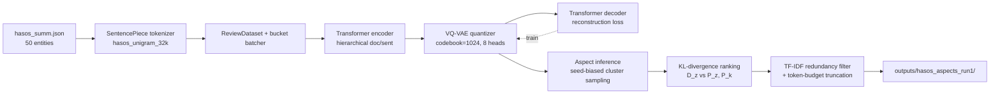

# SemAE — HASOS Hotel Review Pipeline

Aspect-based opinion summarization on hotel review data using the [Semantic Autoencoder (SemAE)](README_ORIGINAL.md) (ACL 2022) with the HASOS 29-aspect taxonomy.

This repo implements **two pipelines** for the same data:

1. **Trained-SemAE pipeline** (the original paper) — VQ-VAE codebook + KL-divergence ranking. **Recommended.**
2. **TF-IDF baseline pipeline** — rules + TF-IDF centroid. Fast, no GPU, but produces lots of duplicate / generic summaries.

> Upstream SemAE README: [README_ORIGINAL.md](README_ORIGINAL.md). HASOS-specific notes: [README_HASOS.md](README_HASOS.md).

---

## Headline results

### Pipeline 1 — Trained SemAE (recommended)

50 entities · 29 aspects · 1,450 summary files · 22 min wall time on 4 parallel shards (RTX 3500 Ada 12 GB).

| Metric | Value |
| --- | --- |
| Aspects with no empty outputs | 21 / 29 |
| Aspects with 100% unique first sentences | **28 / 29** (only `LOY_RETURN` and `SER_ATTITUDE` at 0.98) |
| Cross-aspect duplicate first sentences (out of 1,450) | **83** (≈5.7%) |
| Avg words per summary | ~40 |

Full per-aspect breakdown + sample summaries + cross-aspect duplicate audit:

- [outputs/hasos_aspects_run1_report.md](outputs/hasos_aspects_run1_report.md)
- Raw outputs: `outputs/hasos_aspects_run1/<aspect>/<dev|test>_<entity_id>`
- Report JSON: [outputs/hasos_aspects_run1_report.json](outputs/hasos_aspects_run1_report.json)

### Pipeline 2 — TF-IDF baseline (English-only run on raw CSVs)

ROUGE not available (source CSVs have reviews only, no human gold summaries).

| File | Total rows | English reviews | English ratio | English sentences | ASC | Macro CEC | Weighted CEC |
| --- | ---: | ---: | ---: | ---: | ---: | ---: | ---: |
| `hotel_review1.csv` | 607,260 | 270,658 | 44.57% | 850,307 | **0.7337** | **0.5583** | **0.5624** |
| `hotel_review2.csv` | 1,150,415 | 602,919 | 52.41% | 1,933,276 | **0.7335** | **0.5695** | **0.5740** |
| `hotel_review3.csv` | 591,023 | 538,515 | 91.12% | 3,146,670 | **0.7539** | **0.5713** | **0.5728** |

Per-file folders with `top10_hotels_pipeline_log.md` (auto-detected *Pipeline Issues Found* sections):

- [outputs/hasos_english_only/hotel_review1/](outputs/hasos_english_only/hotel_review1/) — [pipeline log](outputs/hasos_english_only/hotel_review1/top10_hotels_pipeline_log.md)
- [outputs/hasos_english_only/hotel_review2/](outputs/hasos_english_only/hotel_review2/) — [pipeline log](outputs/hasos_english_only/hotel_review2/top10_hotels_pipeline_log.md)
- [outputs/hasos_english_only/hotel_review3/](outputs/hasos_english_only/hotel_review3/) — [pipeline log](outputs/hasos_english_only/hotel_review3/top10_hotels_pipeline_log.md)
- Cross-file summary: [outputs/hasos_english_only/summary_all_files.md](outputs/hasos_english_only/summary_all_files.md)

---

## Pipeline 1 architecture — Trained SemAE



Training recipe (from `train_hasos.ps1`):

- 10 epochs · batch size 5 · Adam lr 0.001 · label smoothing 0.1
- Warmup 4 epochs (no quantization) → K-means codebook init at epoch 4 → full VQ-VAE training
- Losses: CE reconstruction + L1 (sparsity, coeff 1000) + entropy (coeff 5e-5)
- Wall time: ~9 min on RTX 3500 Ada

Inference recipe (from `run_aspect_inference_parallel.py`):

- 4 shards × ~12 entities each, round-robin sharding by entity index
- Per shard: encode all sentences → compute distance distribution → for each aspect, rank by `KL(D_z||P_z) - beta*KL(D_z||P_k)` (beta=0.7)
- Each shard ~22 min wall time (all 4 run in parallel on same GPU)
- UTF-8 file writes (added because Vietnamese accents broke the original `cp1252` default)

---

## Pipeline 2 architecture — TF-IDF baseline

```mermaid
flowchart LR
    A[Raw CSV] --> B[Group by hotel_id]
    B --> C[English language filter]
    C --> D[Sentence split + normalize]
    D --> E[HASOS keyword match<br/>seeds + taxonomy]
    E --> F[Dedup per aspect<br/>unique_opinions]
    F --> G[Cluster weight log&#40;1+n&#41;]
    G --> H[TF-IDF centroid<br/>representative sentence]
    H --> I[CEC / ASC metrics]
```



**Pipeline-2 health summary**

| Stage | Health | Notes |
| --- | :---: | --- |
| Load + group | OK | All rows ingested, `hotel_id` derived from `ref_id` |
| English filter | OK | Detector rule conservative (multi-signal) |
| Sentence split | OK | Standard splitter |
| Aspect match | WARN | Keyword-only — misses paraphrase; 1 sentence often matches 3-6 aspects |
| Dedup | OK | Stable per-aspect unique counts |
| Cluster weight | OK | Log-normalized |
| Representative sentence | FAIL | TF-IDF centroid not aspect-discriminative; same sentence reused across aspects (100+ HIGH issues per file) |
| CEC/ASC | WARN | Numerically correct but inherits noise from step 8 |

This was the original motivation to wire the **trained SemAE** path (Pipeline 1) back in.

---

## How to reproduce

### Pipeline 1 — Trained SemAE

```powershell
$env:PYTHONIOENCODING='utf-8'
cd SemAE\scripts
# 1. Prepare data + seeds (29 HASOS aspects)
python .\prepare_hasos.py
# 2. Train SemAE (10 epochs, GPU 0)
.\train_hasos.ps1 -Gpu 0 -Epochs 10 -RunId hasos_run1
# 3. Aspect inference on 4 parallel shards
python .\run_aspect_inference_parallel.py `
    --model ..\models\hasos_run1_10_model.pt `
    --run_id hasos_aspects_run1 `
    --num_shards 4 --gpu 0
# 4. Regenerate the human-readable report
python .\summarize_aspect_outputs.py --run_id hasos_aspects_run1
```

### Pipeline 2 — TF-IDF baseline (needs raw CSVs)

Raw CSVs (`hotel_review1.csv`, `hotel_review2.csv`, `hotel_review3.csv`) are **not** in this repo (too large). Place them one level above `SemAE/`, then run:

```powershell
$env:PYTHONIOENCODING='utf-8'
cd SemAE\scripts
python .\run_english_only_all_files.py
# Per-file top-10 hotel detailed log:
python .\log_10_hotels_pipeline.py --input-csv ..\..\hotel_review1.csv --limit 10
python .\refactor_pipeline_logs.py
```

Dependencies: `pip install -r requirements.txt`. Tested with Python 3.12, PyTorch 2.10 + CUDA 12.8 on RTX 3500 Ada.

---

## Repo layout

```
src/                                    # SemAE model (encoder, quantizer, train/infer)
scripts/                                # data prep, training & inference launchers
data/hasos/                             # taxonomy + seeds
data/sentencepiece/                     # 32k unigram vocab
outputs/hasos_aspects_run1/             # trained-SemAE summaries (1,450 files)
outputs/hasos_aspects_run1_report.md    # auto-generated quality report
outputs/hasos_english_only/             # TF-IDF baseline outputs (3 CSVs)
models/                                 # ignored (~700 MB of .pt checkpoints)
logs/                                   # ignored (training + inference logs)
```

## License

See [LICENSE](LICENSE).
