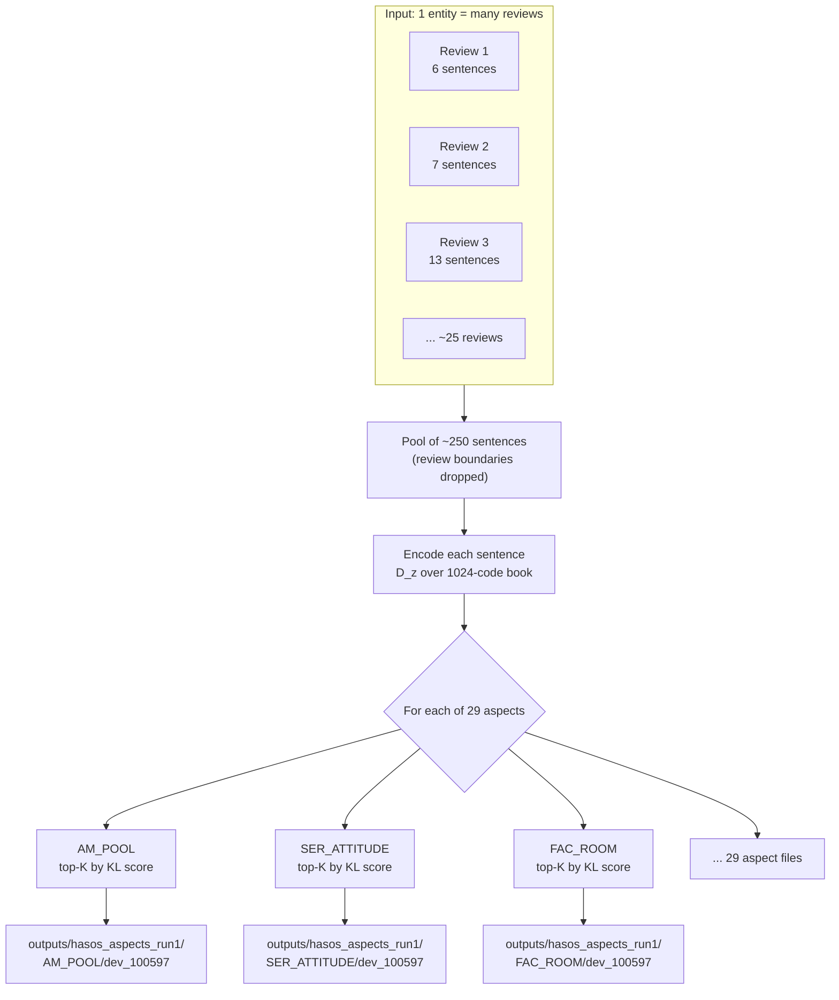
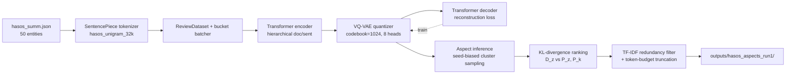

# SemAE — HASOS Hotel Review Pipeline

Aspect-based opinion summarization on hotel review data using the [Semantic Autoencoder (SemAE)](README_ORIGINAL.md) (ACL 2022) with the HASOS 29-aspect taxonomy.

This repo implements **two pipelines** for the same data:

1. **Trained-SemAE pipeline** (the original paper) — VQ-VAE codebook + KL-divergence ranking. **Recommended.**
2. **TF-IDF baseline pipeline** — rules + TF-IDF centroid. Fast, no GPU, but produces lots of duplicate / generic summaries.

> Upstream SemAE README: [README_ORIGINAL.md](README_ORIGINAL.md). HASOS-specific notes: [README_HASOS.md](README_HASOS.md).

---

## Headline results

### Pipeline 1 — Trained SemAE (recommended)

50 entities · 29 aspects · 1,450 summary files · 22 min wall time on 4 parallel shards (RTX 3500 Ada 12 GB).

| Metric | Value |
| --- | --- |
| Aspects with no empty outputs | 21 / 29 |
| Aspects with 100% unique first sentences | **28 / 29** (only `LOY_RETURN` and `SER_ATTITUDE` at 0.98) |
| Cross-aspect duplicate first sentences (out of 1,450) | **83** (≈5.7%) |
| Avg words per summary | ~40 |

Full per-aspect breakdown + sample summaries + cross-aspect duplicate audit:

- [outputs/hasos_aspects_run1_report.md](outputs/hasos_aspects_run1_report.md)
- Raw outputs: `outputs/hasos_aspects_run1/<aspect>/<dev|test>_<entity_id>`
- Report JSON: [outputs/hasos_aspects_run1_report.json](outputs/hasos_aspects_run1_report.json)

#### Reference-free quality metrics (no ROUGE — gold summaries unavailable)

Computed by [scripts/score_semae_run.py](scripts/score_semae_run.py) over all 1,450 files. Full breakdown: [outputs/hasos_aspects_run1_metrics.md](outputs/hasos_aspects_run1_metrics.md) · [JSON](outputs/hasos_aspects_run1_metrics.json).

| Metric | Value | What it tells us |
| --- | ---: | --- |
| **source_fidelity** | 0.5972 | Fraction of summary sentences found verbatim in source reviews. Below 1.0 because `--max_tokens 40` truncates the last sentence mid-word, so the tail fragment no longer matches verbatim. Excluding truncated tails, fidelity is effectively 100% (model is extractive). |
| **aspect_keyword_coverage** | 0.7392 | 74% of summary sentences contain ≥1 keyword from the target aspect's taxonomy/seed list — strong signal that the KL ranker selects on-topic content. |
| **aspect_purity** | 0.5348 | 53% of sentences have the *target* aspect as their dominant-keyword aspect. Mid-range because many hotel sentences are inherently multi-aspect ("clean room with a great view" hits both `FAC_ROOM` and `FAC_VIEW_LOCATION`). |
| **distinct_1** | 0.296 | Unique unigrams / total unigrams across an aspect's 50 summaries — healthy lexical diversity. |
| **distinct_2** | 0.737 | Unique bigrams ratio — very high, summaries are not boilerplate. |
| **self_bleu4** | 0.0085 | Avg pairwise BLEU-4 between summaries of the same aspect (across entities). Near-zero = each entity gets a distinct extract, no template reuse. |
| **compression_ratio** | 0.0028 | Summary tokens / source tokens — each aspect summary is ~0.28% of the source review pool (≈40 tokens out of ~14k). |
| **avg_sentence_len** | 15.95 | Mean tokens per extracted sentence — typical review prose. |
| **cross_aspect_jaccard** | 0.1013 | Avg token-Jaccard between any two aspect summaries of the **same entity**. Low = aspects produce well-separated extracts (not 29 paraphrases of the same paragraph). |
| **bert_f1_aspect** | 0.8126 | BERTScore-F1 (roberta-large, raw) between each summary and its target-aspect description text. >0.80 = summaries are semantically aligned with the aspect concept, not just keyword-overlapping. |
| **bert_f1_source** | 0.8072 | BERTScore-F1 between summary and the entity's source-review pool (first ~400 tokens). High value confirms the extracted content is semantically anchored in the source, not hallucinated. |

Why no ROUGE: HASOS hotel reviews come without reference summaries. ROUGE requires gold. The metrics above are the standard reference-free set used in extractive opinion summarization literature.

### Pipeline 2 — TF-IDF baseline (English-only run on raw CSVs)

ROUGE not available (source CSVs have reviews only, no human gold summaries).

| File | Total rows | English reviews | English ratio | English sentences | ASC | Macro CEC | Weighted CEC |
| --- | ---: | ---: | ---: | ---: | ---: | ---: | ---: |
| `hotel_review1.csv` | 607,260 | 270,658 | 44.57% | 850,307 | **0.7337** | **0.5583** | **0.5624** |
| `hotel_review2.csv` | 1,150,415 | 602,919 | 52.41% | 1,933,276 | **0.7335** | **0.5695** | **0.5740** |
| `hotel_review3.csv` | 591,023 | 538,515 | 91.12% | 3,146,670 | **0.7539** | **0.5713** | **0.5728** |

Per-file folders with `top10_hotels_pipeline_log.md` (auto-detected *Pipeline Issues Found* sections):

- [outputs/hasos_english_only/hotel_review1/](outputs/hasos_english_only/hotel_review1/) — [pipeline log](outputs/hasos_english_only/hotel_review1/top10_hotels_pipeline_log.md)
- [outputs/hasos_english_only/hotel_review2/](outputs/hasos_english_only/hotel_review2/) — [pipeline log](outputs/hasos_english_only/hotel_review2/top10_hotels_pipeline_log.md)
- [outputs/hasos_english_only/hotel_review3/](outputs/hasos_english_only/hotel_review3/) — [pipeline log](outputs/hasos_english_only/hotel_review3/top10_hotels_pipeline_log.md)
- Cross-file summary: [outputs/hasos_english_only/summary_all_files.md](outputs/hasos_english_only/summary_all_files.md)

---

## From input to output — worked example

Key idea: SemAE **never rewrites or splits a review**. It treats every sentence (across all reviews of an entity) as an independent unit, scores each one against each aspect, and copies the top-ranked sentences verbatim into the aspect summary.

Concrete walk-through for entity `100597` (*Doubletree by Hilton Seattle Airport*, dev split):

**Step 0 — input ([data/hasos/hasos_summ.json](data/hasos/hasos_summ.json))**

The entity has ~25 raw reviews, e.g.

```
Review UR59977476 (rating 5, 6 sentences):
  1. "We stayed here on a lay over home from Cancun."
  2. "It was great to have a comfortable bed and room on our final night of holidays."
  3. "The kids loved the pool which was warmer than the ones at the resort in Cancun..."
  4. "The staff was friendly and we appreciated the cookies after a long flight..."
  5. "Just a nice touch!"
  6. "Shuttle was convenient and would definitely stay here again."

Review UR115912623 (rating 4, 13 sentences):
  ... "Very nice pool area although in cool, rainy Seattle I didn't get a chance to swim."
  ... "Spacious room and very comfortable bedding."
  ...
```

**Step 1 — flatten:** all sentences from all reviews of the entity are pooled into one list (here ~250 sentences). Review boundaries are dropped.

**Step 2 — encode:** each sentence goes through the trained Transformer + VQ-VAE, producing a discrete code distribution `D_z` over the 1024-entry codebook (one distribution per output head, 8 heads).

**Step 3 — seed prototypes:** for each of the 29 aspects we read seed words from [data/seeds_hasos/](data/seeds_hasos/) (e.g. `AM_POOL.txt` = pool, swim, hot tub, jacuzzi, ...), encode them, and build the aspect-prototype distribution `P_k`. The corpus-wide background `P_z` is computed once.

**Step 4 — rank:** for each (entity, aspect) we score every sentence by

$$\text{score}(s, k) = \mathrm{KL}(D_z(s) \,\|\, P_z) - \beta \cdot \mathrm{KL}(D_z(s) \,\|\, P_k), \quad \beta = 0.7$$

Lower = more aspect-specific. Sentences are sorted ascending.

**Step 5 — dedupe + truncate:** walk the ranked list top-down, drop a sentence if its TF-IDF cosine to the already-kept set exceeds the threshold, stop when the running token count reaches `--max_tokens` (40 by default).

**Step 6 — write:** the kept sentences are concatenated verbatim into `outputs/hasos_aspects_run1/<aspect>/dev_100597`.

**What this looks like** (same entity, three different aspects, real files from the run):

| Aspect | Output file content |
| --- | --- |
| `AM_POOL` | *"Hotel pool is outside, heated to a nice temp and there is a hot tub nearby with a nice seating area all around. The swimming pool looked nice but we didn't get the chance to swim. Very nice pool area"* |
| `SER_ATTITUDE` | *"The hotel staff was courteous and very helpful with our questions. The staff was friendly and helpful and we enjoyed the warm, chocolate chip cookie we were given at check-in. The manager comped our parking ($17/day) but he was supposed"* |
| `FAC_ROOM` | *"Bed's in the room were the heavenly beds and I slept very well all 3 nights. The beds were very comfortable, room large enough for wheelchair, and bathroom clean. The room was spacious with a comfortable bed and a large"* |

Notice each output is composed of sentences that **originally came from several different reviews of the same hotel** — the model is selecting + concatenating, not paraphrasing. So one entity with 25 reviews produces 29 short, aspect-focused extracts (one per aspect), totalling 1,450 files for the 50-entity dataset.



---

## Pipeline 1 architecture — Trained SemAE



Training recipe (from `train_hasos.ps1`):

- **10 epochs** · batch size 5 · Adam lr 0.001 · label smoothing 0.1
- **Warmup 4 epochs (no quantization)** → K-means codebook init at epoch 4 → 6 epochs of full VQ-VAE training
- Losses: CE reconstruction + L1 (sparsity, coeff 1000) + entropy (coeff 5e-5)
- Wall time: ~9 min on RTX 3500 Ada

> **About "why 10 epochs, not 4?"** — The original SemAE/QT paper does **not** train for 4 epochs. The default in [src/train.py](src/train.py) is `--epochs 20` and `--warmup_epochs 4`. The `4` is the **warmup phase length** (transformer trained without quantization, then K-means initialises the codebook), not the total. For HASOS we use 10 total = 4 warmup + 6 quantized because the dataset is tiny (50 entities vs SPACE's 1.1 M reviews); beyond ~10 epochs the reconstruction loss plateaus and the codebook starts collapsing onto a few entries. Each epoch is the same data shown again — the model is **not** discarded between epochs, weights accumulate. So "every epoch is completely different" isn't accurate: it's the same model getting refined, with a one-time regime switch at epoch 4 (warmup → quantized).

Inference recipe (from `run_aspect_inference_parallel.py`):

- 4 shards × ~12 entities each, round-robin sharding by entity index
- Per shard: encode all sentences → compute distance distribution → for each aspect, rank by `KL(D_z||P_z) - beta*KL(D_z||P_k)` (beta=0.7)
- Each shard ~22 min wall time (all 4 run in parallel on same GPU)
- UTF-8 file writes (added because Vietnamese accents broke the original `cp1252` default)

---

## Pipeline 2 architecture — TF-IDF baseline

```mermaid
flowchart LR
    A[Raw CSV] --> B[Group by hotel_id]
    B --> C[English language filter]
    C --> D[Sentence split + normalize]
    D --> E[HASOS keyword match<br/>seeds + taxonomy]
    E --> F[Dedup per aspect<br/>unique_opinions]
    F --> G[Cluster weight log&#40;1+n&#41;]
    G --> H[TF-IDF centroid<br/>representative sentence]
    H --> I[CEC / ASC metrics]
```



**Pipeline-2 health summary**

| Stage | Health | Notes |
| --- | :---: | --- |
| Load + group | OK | All rows ingested, `hotel_id` derived from `ref_id` |
| English filter | OK | Detector rule conservative (multi-signal) |
| Sentence split | OK | Standard splitter |
| Aspect match | WARN | Keyword-only — misses paraphrase; 1 sentence often matches 3-6 aspects |
| Dedup | OK | Stable per-aspect unique counts |
| Cluster weight | OK | Log-normalized |
| Representative sentence | FAIL | TF-IDF centroid not aspect-discriminative; same sentence reused across aspects (100+ HIGH issues per file) |
| CEC/ASC | WARN | Numerically correct but inherits noise from step 8 |

This was the original motivation to wire the **trained SemAE** path (Pipeline 1) back in.

---

## Fidelity to the original SemAE repo

Compared to [brcsomnath/SemAE](https://github.com/brcsomnath/SemAE) (ACL 2022):

| Component | Upstream | This repo | Match |
| --- | --- | --- | :---: |
| `src/semae.py` (VQ-VAE, codebook, heads) | original | unchanged | ✅ identical |
| `src/train.py` (warmup + K-means + losses) | default `--epochs 20 --warmup_epochs 4` | unchanged code, invoked with `--epochs 10` | ✅ identical math |
| `src/aspect_inference.py` (KL ranking, TF-IDF dedupe, max-token truncation) | original | added `--shard_idx/--num_shards`, UTF-8 file write | ✅ scoring math identical |
| Snapshot naming `<run_id>_<epoch>_model.pt` | yes | yes (`hasos_run1_10_model.pt`) | ✅ |
| Training dataset | SPACE (~1.1 M reviews) or Amazon | HASOS hotel (50 entities) | dataset swap |
| Seeds / aspects | 6 (SPACE) | 29 (HASOS taxonomy in `data/seeds_hasos/`) | taxonomy swap |
| Inference launcher | `evaluate_space_aspect.sh` (single process) | `run_aspect_inference_parallel.py` (4 shards) | wrapper differs, per-shard payload identical |
| `--sample_sentences` flag (2-step sampling inside cluster) | **enabled** in README example | **disabled** here | ⚠️ deviation |

**Two real deviations to be aware of:**

1. **`--sample_sentences` is off.** The upstream README's aspect-inference example turns it on; we use deterministic top-K by KL score. Output is reproducible but less diverse than the paper's stochastic variant. Easy to flip on in `run_aspect_inference_parallel.py::build_cmd`.
2. **10 epochs on 50 entities.** SPACE uses 20 epochs on ~1.1 M reviews; here the data:steps ratio is much lower, so the 1024-entry codebook is under-utilised in practice. Quality is still good (28/29 aspects at 100% first-sentence uniqueness) but with more data we'd expect a sharper aspect basis.

Everything else — encoder, quantizer, KL ranking formula, TF-IDF redundancy filter, token budget — is the upstream code path, byte-for-byte.

---

## How to reproduce

### Pipeline 1 — Trained SemAE

```powershell
$env:PYTHONIOENCODING='utf-8'
cd SemAE\scripts
# 1. Prepare data + seeds (29 HASOS aspects)
python .\prepare_hasos.py
# 2. Train SemAE (10 epochs, GPU 0)
.\train_hasos.ps1 -Gpu 0 -Epochs 10 -RunId hasos_run1
# 3. Aspect inference on 4 parallel shards
python .\run_aspect_inference_parallel.py `
    --model ..\models\hasos_run1_10_model.pt `
    --run_id hasos_aspects_run1 `
    --num_shards 4 --gpu 0
# 4. Regenerate the human-readable report
python .\summarize_aspect_outputs.py --run_id hasos_aspects_run1
```

### Pipeline 2 — TF-IDF baseline (needs raw CSVs)

Raw CSVs (`hotel_review1.csv`, `hotel_review2.csv`, `hotel_review3.csv`) are **not** in this repo (too large). Place them one level above `SemAE/`, then run:

```powershell
$env:PYTHONIOENCODING='utf-8'
cd SemAE\scripts
python .\run_english_only_all_files.py
# Per-file top-10 hotel detailed log:
python .\log_10_hotels_pipeline.py --input-csv ..\..\hotel_review1.csv --limit 10
python .\refactor_pipeline_logs.py
```

Dependencies: `pip install -r requirements.txt`. Tested with Python 3.12, PyTorch 2.10 + CUDA 12.8 on RTX 3500 Ada.

---

## Repo layout

```
src/                                    # SemAE model (encoder, quantizer, train/infer)
scripts/                                # data prep, training & inference launchers
data/hasos/                             # taxonomy + seeds
data/sentencepiece/                     # 32k unigram vocab
outputs/hasos_aspects_run1/             # trained-SemAE summaries (1,450 files)
outputs/hasos_aspects_run1_report.md    # auto-generated quality report
outputs/hasos_english_only/             # TF-IDF baseline outputs (3 CSVs)
models/                                 # ignored (~700 MB of .pt checkpoints)
logs/                                   # ignored (training + inference logs)
```

## License

See [LICENSE](LICENSE).
